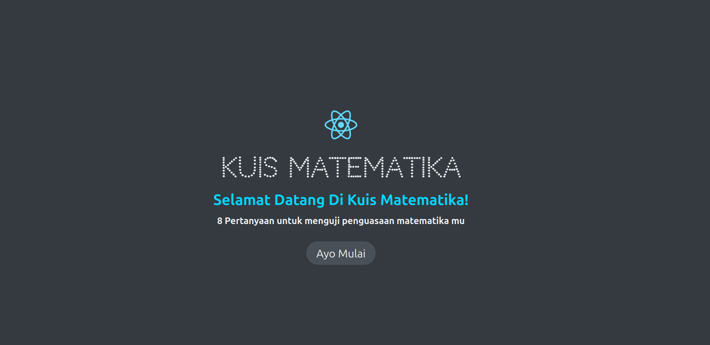

# React Quiz App

Welcome to the **React Quiz App**, a simple and engaging mathematics quiz application designed for children aged 5 to 10 years old. Built using **Vite** and **React**, this project offers a fun and interactive way for kids to practice basic math skills while enjoying a responsive and user-friendly interface.

---

## **Features**

- **Interactive Quizzes**: A variety of math questions tailored for young learners.
- **Age-Appropriate Content**: Focused on basic arithmetic operations suitable for children aged 5 to 10.
- **Responsive Design**: Optimized for desktops, tablets, and mobile devices.
- **Fast and Lightweight**: Powered by Vite for a seamless user experience.

---

## **Technologies Used**

- **React**: For building the user interface.
- **Vite**: For a fast development environment.
- **CSS**: For styling and ensuring responsiveness.

---

## **Getting Started**

### **Prerequisites**

Ensure you have the following installed on your machine:
- [Node.js](https://nodejs.org/) (v14 or later)
- [npm](https://www.npmjs.com/) or [yarn](https://yarnpkg.com/)

### **Installation**

1. Clone the repository:
   ```bash
   git clone https://github.com/rizkibagus/react-quiz-app.git
   ```

2. Navigate to the project directory:
   ```bash
   cd react-quiz-app
   ```

3. Install dependencies:
   ```bash
   npm install
   # or
   yarn install
   ```

4. Start the development server:
   ```bash
   npm run dev
   # or
   yarn dev
   ```

5. Open your browser and visit:
   ```
   http://localhost:5173
   ```

---

## **Usage**

1. Launch the app in your browser.
2. Select a quiz to begin.
3. Answer the questions and receive instant feedback.
4. Enjoy learning math in a fun and interactive way!

---

## **Screenshots**



---

## **Contributing**

Contributions are welcome! If you'd like to enhance the app or fix any issues, follow these steps:

1. Fork the repository.
2. Create a new branch:
   ```bash
   git checkout -b feature/your-feature-name
   ```
3. Make your changes and commit them:
   ```bash
   git commit -m "Add your message here"
   ```
4. Push to your branch:
   ```bash
   git push origin feature/your-feature-name
   ```
5. Open a Pull Request.

---

## **Acknowledgments**

- Thanks to [Vite](https://vitejs.dev/) for providing an excellent development environment.
- Special appreciation to all contributors and testers.

---

## **Contact**

For any questions or feedback, feel free to reach out:
- **GitHub**: [rizkibagus](https://github.com/rizkibagus)

Happy learning! 🎉

